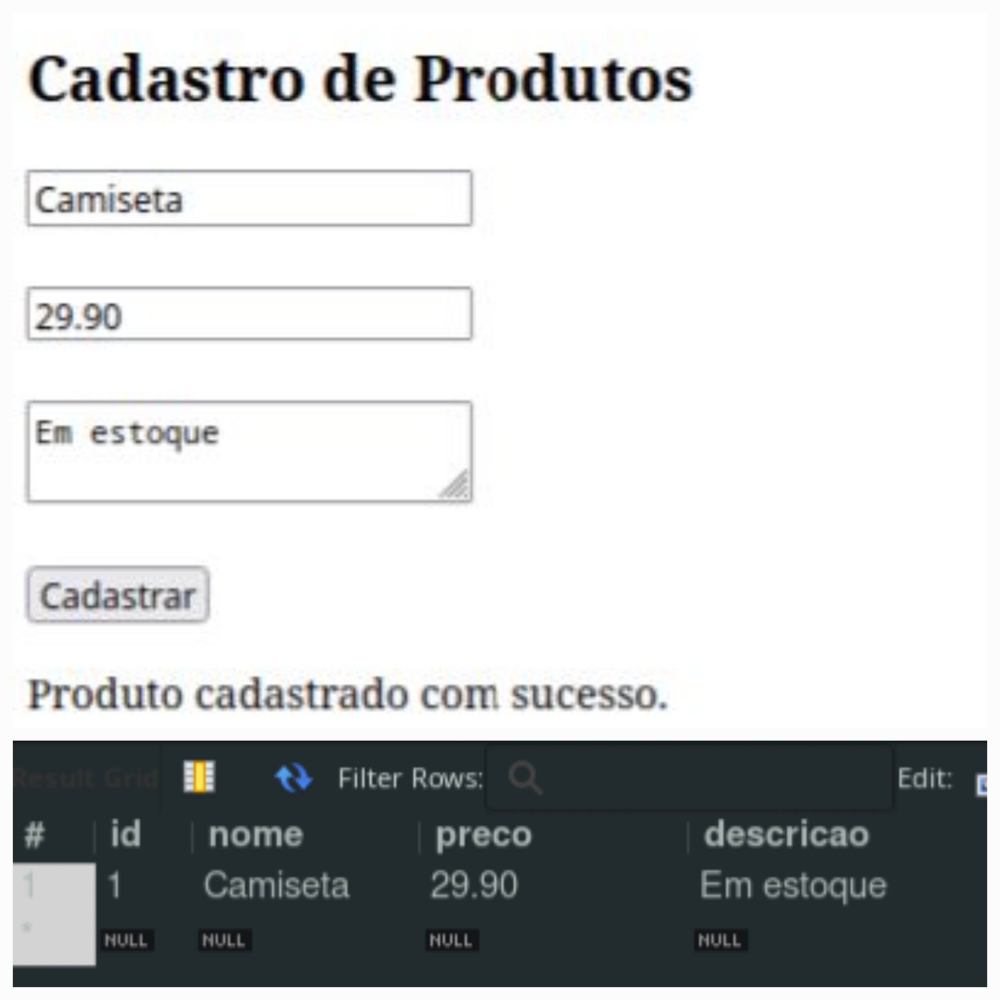
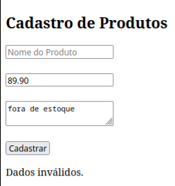
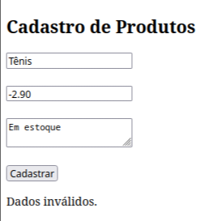
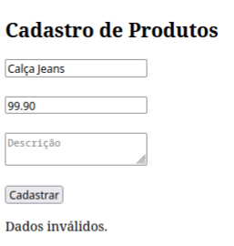
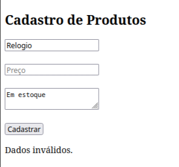

# Cadastro de Produtos e teste de integração manual

Aula de Desenvolvimento de Sistemas do dia 15/05/24 

## Autores

- [@Daniel Sousa](https://www.github.com/ddasni)
- [@Pedro Henrich](https://www.github.com/P3dro1717)

## Tabela de Resultados do Teste
| Produto      | Preço                          | Descrição         | Resultados Obtidos              | Status         |
|:------------:|:------------------------------:|:-----------------:|:-------------------------------:|:--------------:|
| Camiseta     | R$ 29.90                       | Em estoque        | Produto cadastrado com sucesso. | Passou         |
| *(vazio)*    | R$ 89.90                       | Fora de estoque   | Dados inválidos.                | Falhou         |
| Tênis        | **R$ -2.90 (Número Negativo)** | Em estoque        | Dados inválidos.                | Falhou         |
| Calça Jeans  | R$ 99.90                       | *(vazio)*        | Dados inválidos.                | Falhou         |
| Relogio      | *(vazio)*                      | Em estoque        | Dados inválidos.                | Falhou         |

## Screenshots
### teste 1

### teste 2

### teste 3

### teste 4

### teste 5
